# Project Prometheus

Project Prometheus is a Soft Actor-Critic (SAC) reinforcement learning agent that trades US stocks using features derived from OHLCV (open/high/low/close/volume), VWAP, and transactions data, sourced from [Massive](https://massive.com/) (formerly Polygon.io). Early versions (1–4) operated on minute-level data; later versions (5–7) moved to daily bars.

Prometheus succeeds an earlier project, [Marklygon](https://github.com/markk628/MarklygonAI), a DQN-based stock-trading model. Marklygon was limited to a discrete action space — initially just sell-all / hold / buy-max, later widened to quarter increments (sell 25/50/75/100%, hold, buy 25/50/75/100%) — which made precise position sizing difficult. The switch to SAC was driven by that limitation: a continuous action space lets the agent size trades on a smooth scale rather than snapping to coarse buckets.

> This project was built solo. I used Claude (Anthropic) throughout the project — for statistical analysis, code review, and dev-log and README writing — while the research direction, design decisions, and final calls were my own.

## Contents

- [Problem](#problem)
- [Approach](#approach)
- [Design decisions](#design-decisions)
- [Repository layout](#repository-layout)
- [Version history](#version-history)
- [Results](#results)
- [Lessons learned](#lessons-learned)
- [Setup & usage](#setup--usage)

## Problem

Financial markets are notoriously nonstationary: a signal that was predictive in one regime can decay or invert in the next, which makes reliably timing entries and exits hard even for experienced traders. Prometheus poses a focused question — can an SAC agent, given a continuous action space and features derived from OHLCV, VWAP, and transactions data, learn a policy that generalizes across regimes well enough to beat a passive buy-and-hold benchmark?

## Approach

### Execution model

All versions trade through a cost-aware environment modeled on Alpaca's fee schedule (the intended broker): regulatory fees (SEC/TAF/CAT), bid-ask spread, and slippage are charged on every fill and flow directly into the reward. These figures are Alpaca-specific — the SEC/TAF/CAT fees carry across brokers, but commissions and spread assumptions vary by platform. Daily versions use more conservative parameters ($0.05 spread, 10 bps slippage) than the tighter intraday assumptions, appropriate to the horizon. Costs are modeled, not assumed away, so backtest performance reflects what the strategy would actually net.

### Data & features

The data pipeline — feature engineering → normalization → audit, plus dimensional reduction in v4 — was assembled incrementally rather than fixed from the start, with per-version specifics in the version entries below. Two aspects are worth detailing here.

**Normalization.** The scheme tightened over the project rather than staying fixed. v1 used none — features were fed raw. v2–v3 fit a single global StandardScaler on the training set then clipped to ±5. From v4 on it became fully causal: per-ticker rolling z-scores over a strictly past window ([t−window, t−1]), plus the per-timestamp cross-sectional z-scores that v4 introduced (each feature z-scored across all tickers, and within its sector) — so no validation or test statistics ever leak backward into a training bar.

**Auditing.** From v4 on, a data auditor gates every run — it checks feature statistics (mean, variance, skew), clipping saturation against the ±5 bounds, train/valid/test distribution drift, and pairwise multicollinearity (|ρ| ≥ 0.95); the daily versions add single-day price-discontinuity detection (≥ 50% / ≥ 100%) and delisting/pre-IPO null classification. Critically, it *verifies* rather than filters — all filtering lives upstream in feature engineering, so a clean run should audit to near-zero critical flags, making it a regression test on the data rather than a preparation step. Its purpose shifts across the project: in v4 it guarded a 2,935-column feature set going through lossy autoencoder compression; from v5 on it guards the full Massive flat-file universe (2942 tradable tickers) and a heavy stack of cross-sectional and regime features, where a single mishandled corporate action can manufacture signal the agent will exploit.

### Architecture

Every version is a Soft Actor-Critic agent: off-policy actor-critic with twin Q-critics (the minimum of the two curbs overestimation bias), a tanh-squashed Gaussian policy, automatic entropy-temperature tuning, and soft target updates. The observation is split into channels rather than concatenated — a market channel (the windowed per-ticker features) plus separate regime, temporal, and portfolio channels — and only the market channel passes through a sequence encoder; the rest enter through their own small MLPs and fuse before the actor and critic trunks (which share the market encoder). That encoder is the piece that evolved: a plain 3-layer CNN on a single ticker (v1–v3), a CNN-Transformer over autoencoder latents with regime features routed around it (v4), a hybrid CNN-Transformer on compact daily features (v5), and finally a last-bar MLP once the encoder was shown not to earn its cost (v6–v7). The action space tracked the problem too: a single continuous buy/sell/hold signal early, a target-position formulation with a proportional deadband from v4, and a 5-dimensional allocation vector in v7.

### Training & validation

Training is off-policy SAC from a replay buffer (recency-biased sampling on the daily versions), with the reward being a single unshaped per-step portfolio return — costs enter through PnL rather than a bespoke penalty term, as detailed under Execution model above. Episode length grew with the horizon: one day (v1–v2), five days (v3–v4), and a full trading year on daily bars (v5–v7). Validation moved from a chronological hold-out to expanding-window walk-forward as the data lengthened (detailed in the [Data, splits, and seeds](#version-history) note below). The experimental discipline is the constant: one variable changes per run for clean attribution, decision rules are fixed before each run, and — from v6 on — every result is a multi-seed Monte Carlo sweep to separate signal from seed noise, backed by full determinism hardening.

## Design decisions

### Reward design

Every version optimizes a single, unshaped reward — per-step portfolio return — rather than a hand-tuned, multi-term objective. This is a deliberate reaction to Marklygon, whose shaped reward was repeatedly gamed by the policy (reward hacking). A single, clear objective leaves far less surface for the agent to exploit, and it keeps results honest: when episode return improves, the policy got better at the only thing it was ever asked to optimize.

### Data storage

An earlier iteration evaluated a TimescaleDB warehouse for the raw minute data (`database_manager.py`, with a parallel bulk-ingest variant in `database_manager_parallel.py`). It was prototyped end to end — hypertables, continuous aggregates for multi-resolution bars, and tiered compression — but not adopted for 1.x: the pipeline reads the full dataset into memory once per run, so the warehouse's advantages (fast slice queries, on-demand rollups, concurrency) don't justify the storage and operational overhead at this scale. Prometheus 1.x uses columnar Parquet files instead. The warehouse remains a candidate for Prometheus 2.0, where larger data volume changes the calculus.

## Repository layout

Each version lives on its own branch and was merged through a dedicated pull request, so the complete history of any version — commits, diffs, and review notes — is self-contained and browsable. Commit and documentation discipline tightened as the project matured: versions 5–7 use run-tagged commits (`runN: <description>`) backed by dev logs that walk through each run's ablations and Monte Carlo sweeps, while versions 1–4 are more exploratory (version 4 has a dev log; the earlier three predate the practice).

## Version history

Seven versions, one throughline: a methodical search for where — if anywhere — a reinforcement-learning agent can find tradable signal. The first four established a wall. Minimal features on minute bars taught the agent only to stop trading (v1); richer, normalized features bought a faint validation flicker (v2); longer multi-day episodes added variance, not skill (v3); and an 80-ticker cross-sectional feature set confirmed that minute-level signal-to-noise, not the model, was the ceiling (v4). That verdict drove the pivot that changed everything: daily bars and ticker-agnostic training produced the first real edge (v5). From there the work turned to refinement and honesty — simplifying the architecture to a plain MLP and diagnosing the generalization bottleneck (v6) — and finally to a conceptual leap, from timing one ticker to allocating across a basket (v7), which looked strong in aggregate, hit a regime-generalization wall that four fixes couldn't move — until a fifth, uniform replay, partially did — and then met its pre-registered out-of-sample backtest, which returned a clean negative: no risk-adjusted edge over simply holding the basket. Each entry below is a delta from the one before it, with its charts, exact features, dev log, and source.

**Data, splits, and seeds.** Versions 1–4 split their data chronologically into 70% train / 15% validation / 15% test (first and last day of each split trimmed); versions 5–7 use expanding-window walk-forward validation instead. Data coverage grows across the project: v1–3 train on minute bars from 2021-05-06 to 2025-05-05, v4 on minute bars from 2020-01-02 to 2026-04-02, and v5–7 on daily bars from 2004-12-13 to 2026-04-24. Minute-level training (v1–4) samples trading days in random order, to decorrelate episodes and push toward generalization rather than memorizing a fixed calendar sequence. Every run uses a fixed seed of 42, except the Monte Carlo seed sweeps introduced from v5 onward.

Walk-forward arrived with daily bars in v5. A decades-long daily history spans many market regimes, so a single fixed split only shows how the model does on one contiguous later slice — not whether it generalizes across regimes. Walk-forward instead retrains on all history to date and validates on each successive unseen year, repeatedly testing the policy on new out-of-sample regimes — a stronger probe of robustness to nonstationarity, and closer to how the model would actually be deployed.

<details>
<summary><b>Walk-forward folds (v5–7)</b></summary>

Expanding window: the training set always starts at 2005-01-01 and grows by one year per fold, and each fold validates the following calendar year. Everything after 2023-12-31 is held out for testing.

| Fold | Train | Validate |
|-----:|-------|----------|
| 1 | 2005-01-01 → 2014-12-31 | 2015 |
| 2 | 2005-01-01 → 2015-12-31 | 2016 |
| 3 | 2005-01-01 → 2016-12-31 | 2017 |
| 4 | 2005-01-01 → 2017-12-31 | 2018 |
| 5 | 2005-01-01 → 2018-12-31 | 2019 |
| 6 | 2005-01-01 → 2019-12-31 | 2020 |
| 7 | 2005-01-01 → 2020-12-31 | 2021 |
| 8 | 2005-01-01 → 2021-12-31 | 2022 |
| 9 | 2005-01-01 → 2022-12-31 | 2023 |

</details>

### v1 — minimal-feature baseline (1 day, minute bars, TSLA)

[PR #2](https://github.com/markk628/Project-Prometheus/pull/2)

The starting point: single-ticker TSLA intraday day-trading on 1-minute bars, with one continuous action (−1 sell / 0 hold / +1 buy, invalid actions masked to hold) and a deliberately minimal nine-feature observation — six cyclical time encodings plus log return, log volume, and VWAP distance — fed unnormalized to a CNN (market) + MLP (portfolio) SAC agent. Each episode is one regular-hours day with the balance reset daily and all shares liquidated at the close. The question was blunt: can SAC find anything to trade on from raw basics alone?

It couldn't — and, more precisely, it learned that it couldn't. Across 200 episodes the policy fell from fully exploratory (entropy ≈ 0.65) toward its −1 target as it concentrated on inaction; fee impact dropped from ≈ 0.175% of portfolio per episode to near zero; and per-episode returns converged toward 0 from below (train mean −1.01%, only 13.5% of episodes positive). The three curves are one story: with no exploitable edge in the features, the cost-optimal policy under transaction costs is to stop trading, and SAC found it — abandoning the loss-making random churn of early training for near-inaction. The agent and the cost model were working; the ceiling was the information content of the inputs. Every re-run reproduced the same three shapes (entropy down, fees down, returns → 0), which pinned the limit on the feature set rather than the seed or hyperparameters — and motivated the richer inputs of v2.

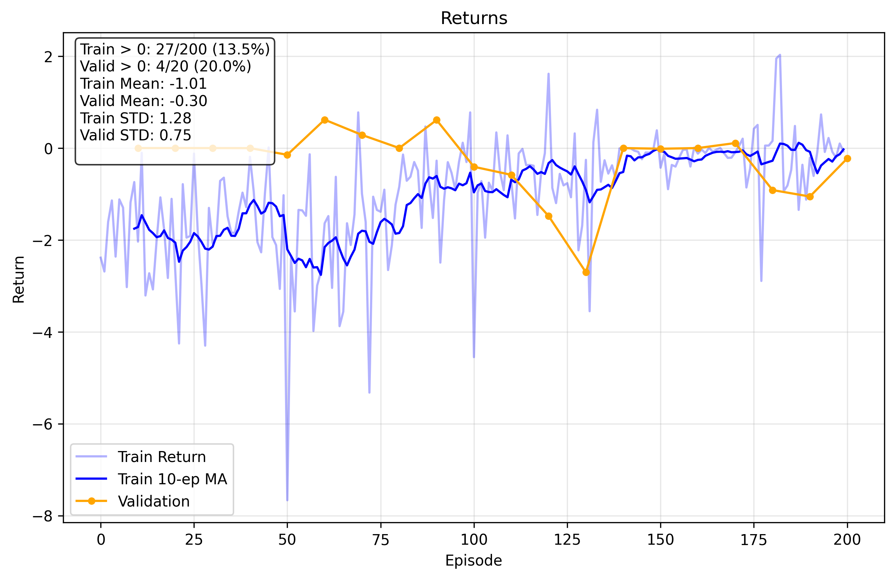
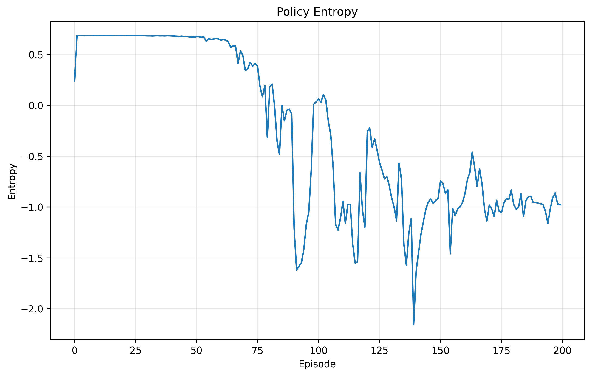
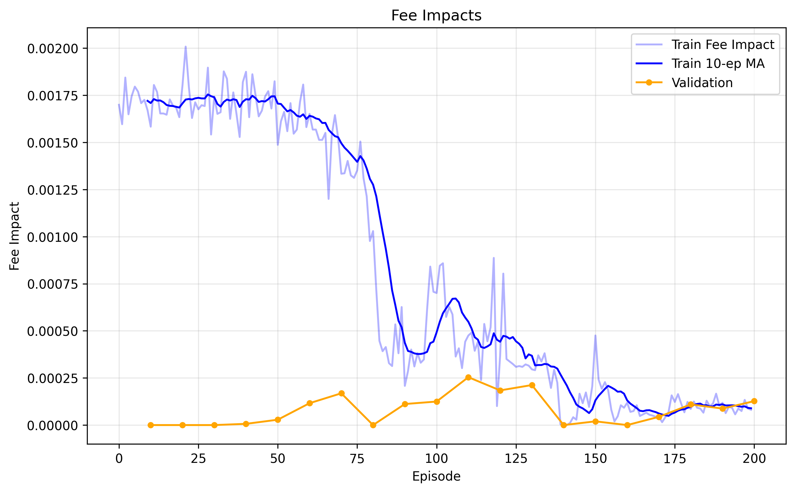

<details>
<summary><b>Features — v1 (9 market + 2 portfolio)</b></summary>

**Market (9):** `minute_sin`, `minute_cos`, `hour_sin`, `hour_cos`, `day_sin`, `day_cos`, `log_return_1`, `volume_log`, `price_vwap_distance`

**Portfolio (2):** cash ratio, stock ratio

</details>

### v2 — richer, normalized features (1 day, minute bars, TSLA)

[PR #3](https://github.com/markk628/Project-Prometheus/pull/3)

Same architecture, reward, episode structure, and hyperparameters as v1; every change is on the input side. The market observation grows from 9 features to 22 — activating a technical-indicator set (15-minute volatility, EMA-5/15 ratios, ADX, ROC, 15-bar cumulative return, volume ratio, and volume–price correlation) alongside raw volume/VWAP/transactions and two intraday-clock features (minutes-since-open, minutes-to-close) — and, unlike v1, everything is standardized with a train-fit `StandardScaler` clipped to ±5 rather than fed raw. The portfolio state doubles from 2 to 4, adding unrealized-PnL % and normalized hold time so the agent can see its open position's profit and age. The hypothesis was direct: hand v1's do-nothing agent something richer and see whether an edge appears.

The added information barely moved training. Entropy and fee impact collapse on the same schedule as v1, the agent again drifts toward inaction, and the training mean stays negative (−1.04% vs v1's −1.01%). The needle moved only on validation: mean return crossed from −0.30% to +0.19% and the share of positive validation episodes rose from 20% to 50%. But on just 20 validation episodes that mean sits little more than one standard error above zero — suggestive, not significant. A flicker of generalizable signal, not an edge. But the training moving-average was trending up across the run — so rather than touch the features, v3 gives the agent more room and more training: five-day episodes, and far more of them.

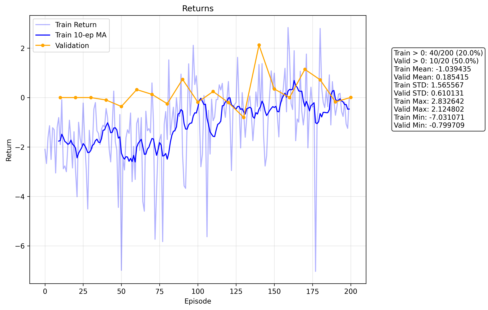
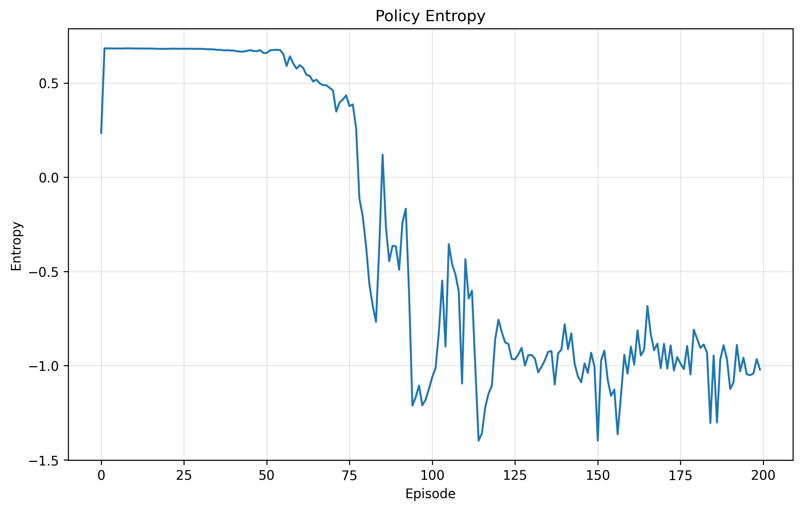
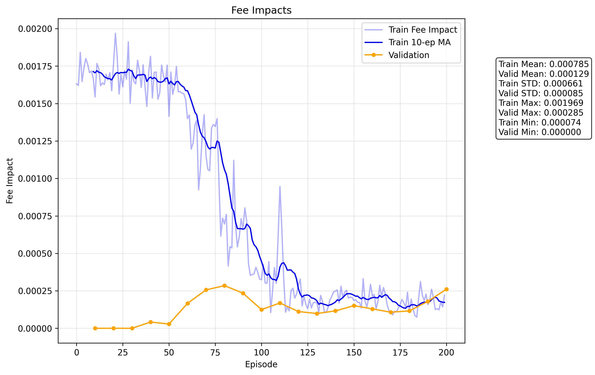

<details>
<summary><b>Features — v2 (22 market + 4 portfolio)</b></summary>

**Market (22):** `volume`, `vwap`, `transactions`, `minute_sin`, `minute_cos`, `hour_sin`, `hour_cos`, `day_sin`, `day_cos`, `minutes_since_open`, `minutes_to_close`, `volatility_15m`, `ema_ratio_5`, `ema_ratio_15`, `adx_20`, `roc_10`, `cum_return_15`, `volume_ratio_15m`, `volume_price_corr_15m`, `price_vwap_distance`, `log_return_1`, `volume_log`

**Portfolio (4):** cash ratio, stock ratio, unrealized PnL %, normalized hold time

</details>

### v3 — multi-day episodes (5 consecutive days, minute bars, TSLA)

[PR #4](https://github.com/markk628/Project-Prometheus/pull/4)

Identical to v2 in every respect — same 22 market and 4 portfolio features, same normalization, same CNN + MLP SAC agent, same reward and hyperparameters — except the episode is now five consecutive trading days instead of one, so the agent holds across sessions and overnight gaps within an episode. The question: does a longer horizon give it enough context to find an edge a single day couldn't?

It didn't, and the extra days mostly widened the outcome distribution rather than teaching anything. Behavior is unchanged — entropy collapses to its −1 target (faster now, since each episode supplies five times the transitions), and fee impact follows the same decaying curve at a higher per-episode level. The returns tell the real story. Mean return is negative and slightly worse than v2 (train −1.68% vs −1.04%), and v2's faint positive validation signal is gone: validation mean flips from +0.19% back to −1.24%, with only 29% of episodes positive. What moved most is variance — five-day cumulative P&L swings push the return standard deviation roughly 3× higher on train and nearly 8× on validation, with episodes now ranging from −20% to +20%. And all of this held despite far more training: ~690 episodes of five days each versus v2's 200 single days, on the order of 17× the environment steps. The longer horizon added scale and noise, not skill — v2's do-nothing dynamic smeared across a much wider distribution, a little worse and a lot noisier, with the extra training confirming that the ceiling is the signal in the inputs, not the training budget. That verdict is what pushed v4 toward a heavier attack on representation.

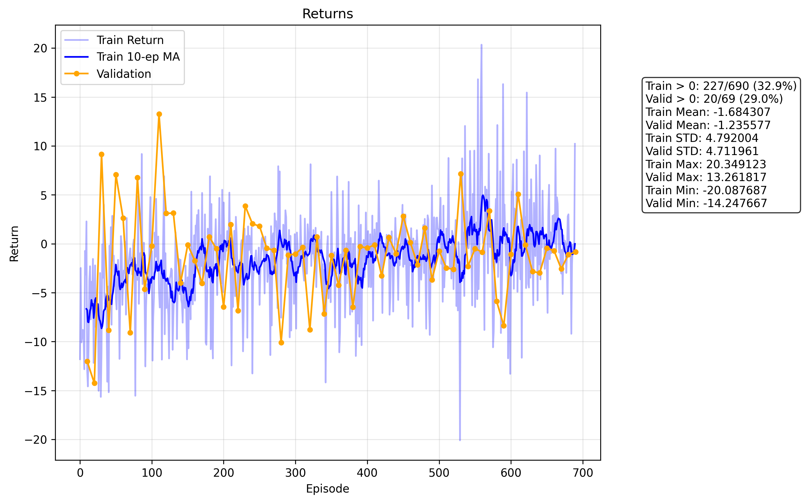
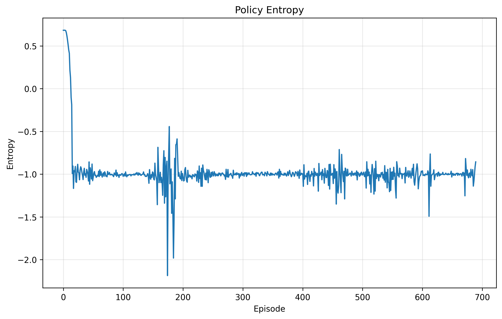
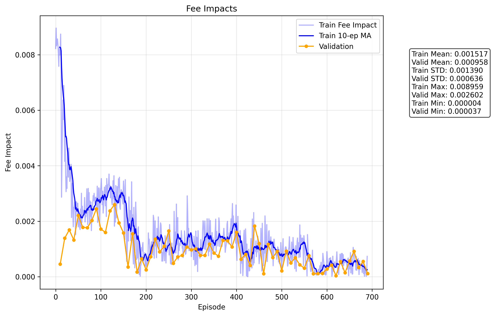

<details>
<summary><b>Features — v3 (same as v2: 22 market + 4 portfolio)</b></summary>

Unchanged from v2 — see the v2 feature list above.

</details>

### v4 — multi-ticker features + dimensional reduction (5 consecutive days, minute bars, TSLA)

[PR #5](https://github.com/markk628/Project-Prometheus/pull/5)

The last and largest minute-level attempt. If single-ticker features hold no signal, maybe cross-sectional context does — so v4 feeds the agent an 80-symbol basket (index, sector, rates, credit, volatility, commodity, and single-name ETFs and stocks; see `TICKERS` in [`config.py`](https://github.com/markk628/Project-Prometheus/blob/v4/src/config/config.py), with both `FB` and `META` present to bridge the mid-window ticker rename). That explodes the engineered feature set to 3,016 columns, so the market slice is compressed to 128 latents by a deep autoencoder, while the 1,268 regime features (cross-sectional and sector z-scores, relative strength vs SPY, VIX term structure, market breadth) are deliberately routed *around* the autoencoder into their own MLP — reconstruction loss preserves variance, not trading relevance, so low-variance regime shifts shouldn't be averaged away. Two reduction methods were run (autoencoder-only and a PCA⊕autoencoder hstack); PCA-only and AE-of-PCA were skipped on the reasoning that linear PCA can't capture nonlinear market structure. The market encoder also grew into a CNN-Transformer, and — critically — the action space was rebuilt from "how much to trade" (delta) to "where I want to be" (target position) with a proportional deadband, backed by an alpha floor and reward clipping. Because a 1,659-column set going through lossy compression is easy to get silently wrong, it is gated on both sides of reduction by the data auditor (described under Approach → [Data & features](#data--features)). The replay buffer was its own challenge: a naive flat buffer holding every windowed state outright tried to allocate a single 1,000,000 × 74,048 float32 array and crashed at 276 GiB, so [`IndexReplayBuffer`](https://github.com/markk628/Project-Prometheus/blob/v4/src/v4/model/replay_buffer.py) keeps only one integer index into a shared feature array per transition and reconstructs the window on sample — a memory-for-compute trade whose per-batch reconstruction cost a background prefetch thread then hides. Still minute bars, still 5-day episodes, still trading only TSLA.

The action-space refactor and alpha floor did exactly what they were designed to do — and that is what makes v4 conclusive. In v1–v3 the policy collapsed to inaction; here it doesn't. Exploration stays alive — entropy drifts from 0.68 down below 0.3 but never reaches its −0.1 target — so the agent keeps trading (1,533 average trades per training 250 average trades per validation episode, fee impact holding near 0.37% instead of decaying to zero for training, 0.04 for validation). With exploration finally healthy, the real problem is exposed: training returns are catastrophic — mean −12.5% per episode, and exactly 1 of 360 training episodes finished positive — because the exploration noise (σ ≈ 0.2 on a [−1, 1] action) constantly trips the deadband into money-losing noise-trades the weak minute signal can't offset. The tell is the train/validation gap: the *deterministic* validation policy, with no exploration noise, is roughly break-even (mean −0.76%, 44% of episodes positive) — but it beats buy-and-hold only 33% of the time. Sharpe says the same (validation ≈ −1.8, the meaningful figure; the training ≈ −38 is inflated by annualizing a per-episode Sharpe off minute bars and is dominated by noise). The signal exists — the greedy policy can roughly track price — but it is too faint to learn through minute-level exploration noise, and it is not real alpha even once the noise is removed. Neither reduction method changed this, and neither did walking the alpha floor from 0.05 to 0.01.

That was the end of the road for minute data: with an 80-ticker feature set + temporal and regime features, deep compression, a CNN-Transformer, and an action space that kept exploration healthy, minute-level signal-to-noise was still the wall — the case for moving to daily bars, where a 1% move is signal rather than noise. The full blow-by-blow — the alpha-collapse diagnosis, the target-position fix, the alpha-floor walk, and the move-to-daily reasoning — lives in the v4 dev logs ([`dev_log_action_space_refactor.md`](https://github.com/markk628/Project-Prometheus/blob/main/src/v4/dev_log_action_space_refactor.md), [`dev_log_alpha_floor_adjustment.md`](https://github.com/markk628/Project-Prometheus/blob/main/src/v4/dev_log_alpha_floor_adjustment.md), [`dev_log_move_to_daily.md`](https://github.com/markk628/Project-Prometheus/blob/main/src/v4/dev_log_move_to_daily.md)).

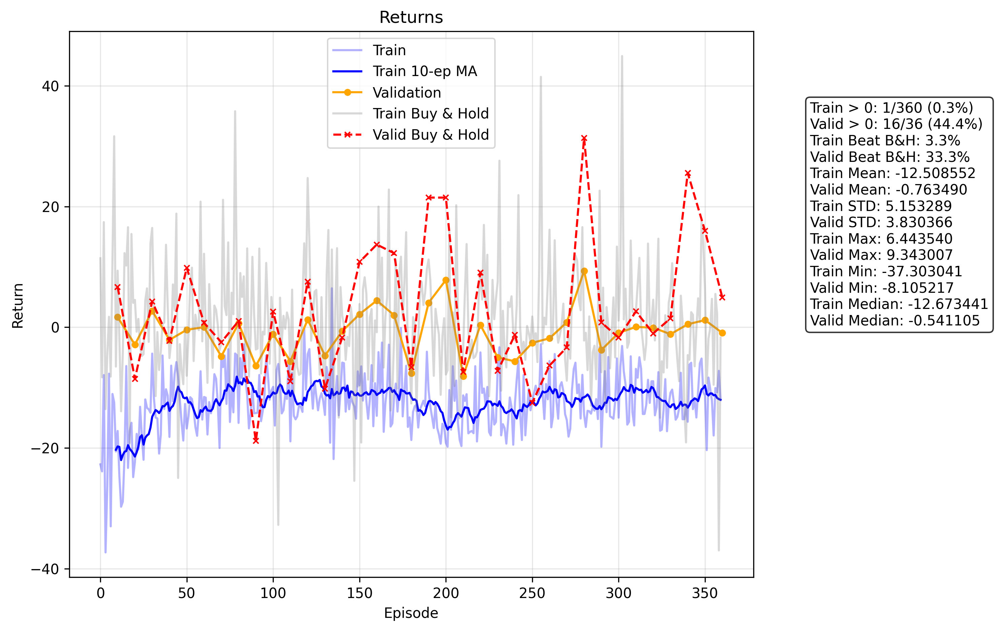
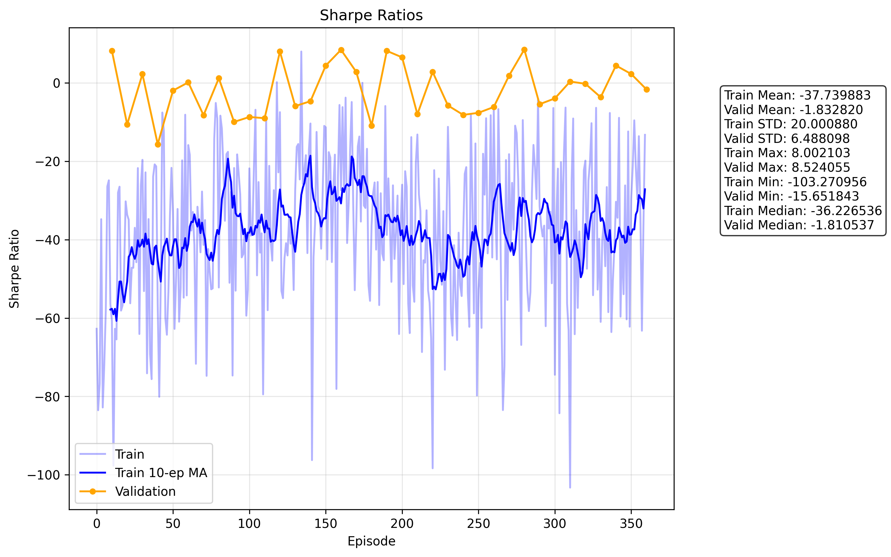
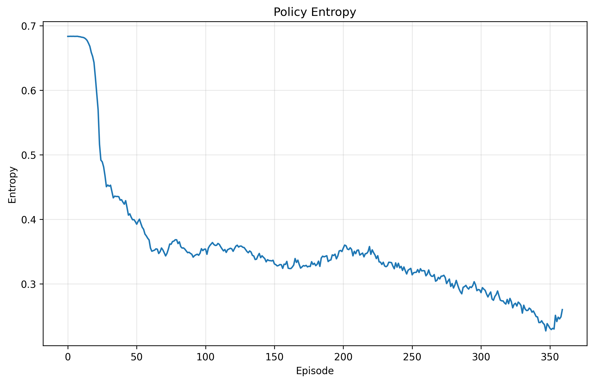
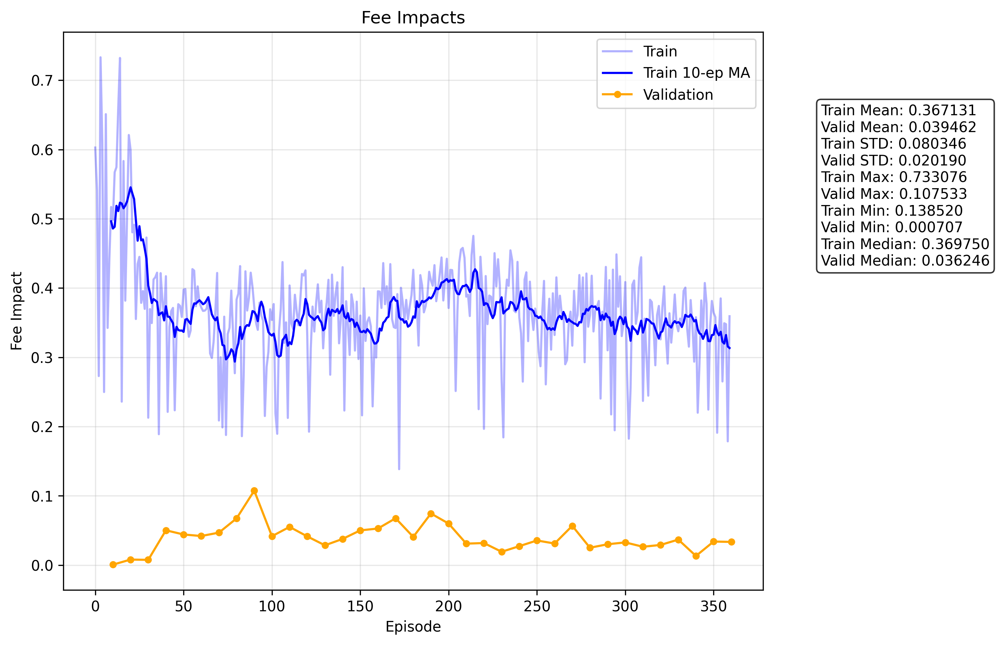

Results shown are the autoencoder-only reduction; the PCA⊕autoencoder hstack produced materially the same outcome.

<details>
<summary><b>Features — v4 (multi-ticker basket, reduced)</b></summary>

**Basket:** 80 symbols — see `TICKERS` in [`config.py`](https://github.com/markk628/Project-Prometheus/blob/v4/src/config/config.py).

**Market:** 1,659 engineered features → **128 autoencoder latents** (the alternate run uses a PCA⊕autoencoder hstack), fed as a 120-step window to a CNN-Transformer.

**Regime (1,268, kept raw, separate MLP):** cross-sectional and sector z-scores, relative strength vs SPY, VIX term structure, market breadth.

**Temporal:** six cyclical time encodings + minutes-since-open / minutes-to-close.

**Portfolio (4):** cash ratio, stock ratio, unrealized PnL %, normalized hold time.

</details>

### v5 — the daily pivot: ticker-agnostic swing trading (daily bars)

[PR #6](https://github.com/markk628/Project-Prometheus/pull/6)

The turning point, and the first version to clear its own noise floor. v5 makes two jumps at once: minute → daily bars, and single-ticker → the whole market. Training and validation are now ticker-agnostic — each episode samples a random ticker and a random one-year (252-day) window from the 2,942 tradable tickers left after filtering Massive's full flat-file universe (down from 35,370 tickers), across 22 years and the nine expanding walk-forward folds. TSLA is held out as the test target; the point of training across thousands of tickers and decades is generalization — vastly more diverse experience than any single name could offer. The pipeline normalizes causally on two axes — a per-ticker rolling z-score (252-day window) plus global- and sector-level cross-sectional z-scores at each timestamp — and adds long-horizon regime context (market breadth, VIX term structure, relative strength vs SPY). The v4 autoencoder is gone (daily per-ticker features are already compact, 59 to be exact), but the hybrid CNN-Transformer encoder, target-position action space, alpha floor, and reward clipping carry over; the replay buffer switches to full-state storage with recency-biased sampling, since transitions now span many tickers and the shared-array index trick no longer applies.

Much of v5 was a hunt for data ghosts, and the fixes are a real part of the story. Run 1 produced absurd episodes — +2,088% on a bankrupt ticker — traced to two bugs: forward-filling prices across CIT's month-long Chapter 11 gap manufactured a fake −42% relist the agent happily exploited, and zero-filled close columns turned post-delisting rows into "tradable at $0." The fixes: lifecycle segmentation (any gap ≥ 10 trading days splits a ticker into independent segments, so a bankruptcy can't bleed across lifetimes), single-day discontinuity gates (≥ 50% flagged, ≥ 100% filtered), honest close-null preservation, and a $5 median-price penny-stock floor. The auditor's job is to *verify*, not filter — after the upstream filters, its critical-discontinuity count should audit to zero, making it a regression test on the pipeline rather than a preparation step. One vendor limitation is documented rather than solved: Massive is missing some historical splits (1,108 suspicious 50–100% one-day moves, including GOOG's 2014 Class C split), which costs ~14% (513 tickers) of the universe to the discontinuity filter — the reason a Databento migration is slated for Prometheus 2.x.

And it works. The best configuration — long-horizon regime features, a slow alpha learning rate, and an update-to-data ratio of 2 — lands a validation Sharpe of 0.47 mean, +8.52% mean return (+7.06% median), 74.4% of episodes positive, and a peak fold-6 Sharpe near 1.1 on +27–34% returns. Fees are now negligible (~0.02% per validation episode; daily trading is on average 54 trades per validation episode, not the 250 that bled v4). The path there was a clean single-variable ablation: a clean baseline (+1.87%), then long-horizon regime features acting as a regularizer (+4.11%), then a *useful failure* — UTD = 4 overfit, actor loss dropping while validation degraded — and finally UTD = 2 as the sweet spot (+8.52%): a three-point dose-response with underfit, well-fit, and overfit cleanly separated. Note the contrast with the minute era — entropy still collapses to its −1 target, but here concentration means the policy settled onto a *profitable* strategy rather than onto inaction; the daily signal is finally strong enough to learn. Full run-by-run detail — the data-bug diagnoses, the UTD dose-response, the methodology lessons — is in [`dev_log_v5.md`](https://github.com/markk628/Project-Prometheus/blob/main/src/v5/dev_log_v5.md).


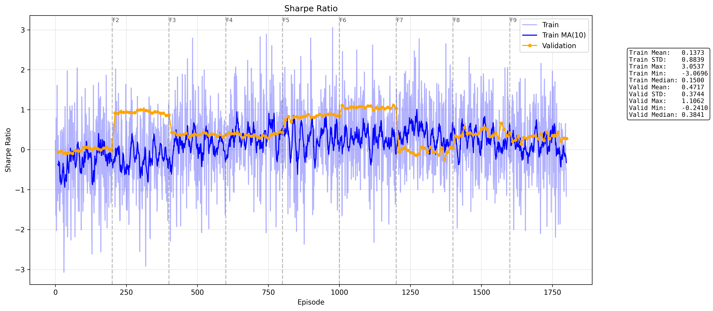
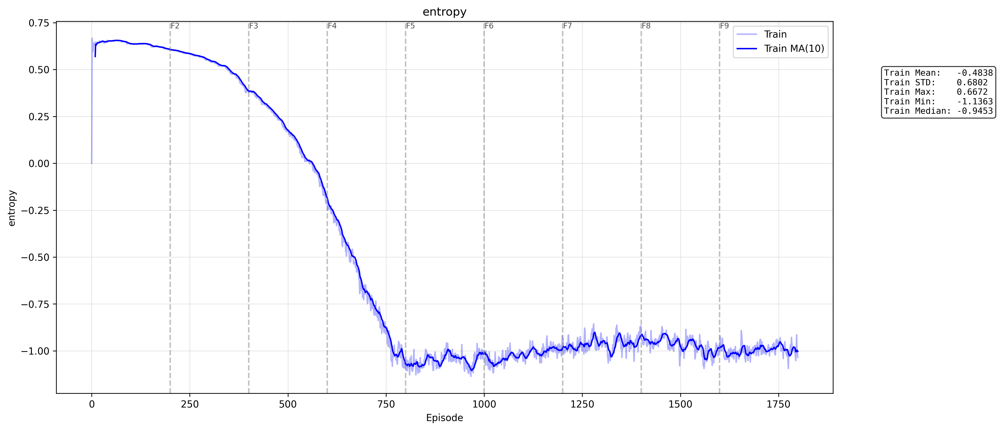
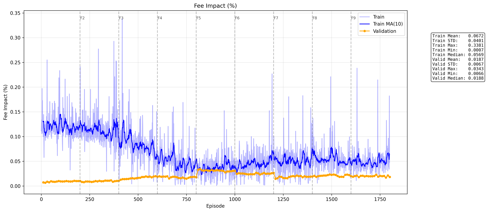

<details>
<summary><b>Features — v5 (daily, ticker-agnostic; per-ticker + cross-sectional + regime)</b></summary>

**Universe:** 2942 tradable tickers (filtered from 35,370 in Massive's flat files) + 25 regime tickers, 22 years.

**Per-ticker market (59):** returns, volatility, trend, volume, and candlestick features over 5/20/60-day horizons — per-ticker causal rolling z-score (252-day window).

**Cross-sectional:** each feature also z-scored globally (`_cs_zscore`) and within sector (`_sector_zscore`) at each timestamp.

**Regime (shared + per-ticker):** market breadth, VIX term structure, relative strength vs SPY, with scale-matched deltas.

**Temporal:** cyclical calendar encodings.

**Portfolio (7):** cash ratio, stock ratio, unrealized PnL %, hold-time ratio, episode Sharpe (removed in v6), current drawdown, win rate.

</details>

### v6 — simplify and diagnose (daily bars, ticker-agnostic)

[PR #7](https://github.com/markk628/Project-Prometheus/pull/7)

A run of single-variable ablations on the v5 (UTD = 2) baseline — most rejected, and the ones that shipped simplified rather than enlarged. Rejected: the portfolio_state subtractions in runs 1–2 (removing episode-Sharpe and others), and the macro regime features in run 3a — yield curve, credit spread, size/growth factor, sector rotation — which added little to single-ticker timing once per-ticker features already exist. What shipped: per-ticker delta features (4a), long-history per-ticker features at 120/252-day horizons (4c), and the headline change — **4b replaced the CNN-Transformer market encoder with an MLP on the last bar and matched it** at ~37% fewer parameters and ~33% faster training. The encoder's temporal contribution was real but tiny (~0.01 Sharpe/fold), and a transformer prone to memorizing ≤ 252-day episodes wasn't worth its cost; the per-ticker deltas hand the last-bar snapshot the trajectory information the window would otherwise have carried. Alongside the modeling work: full determinism hardening (RNG + cuDNN), a shift to 3-seed Monte Carlo evaluation, and a refactor of the 3,000-line feature engineer into focused modules.

The metric gain is modest, and it's stated plainly. Across three seeds, v6 lands **+10.47% ± 3.91 return, 0.484 ± 0.092 Sharpe, 60.3% ± 9.5 positive** — versus the v5 baseline re-run under the same protocol (+9.18% ± 3.41, 0.485 ± 0.052, 62.0% ± 5.9). That's +1.29 points of return at flat Sharpe and a hair lower positive rate. v6's real yield isn't the number: it's the architectural simplification that carries into v7, the methodology hardening, and — above all — a diagnosis.

Five qualitatively different changes (a subtractive ablation, additive macro features, additive per-ticker deltas, the MLP swap, and additive long-history features) all degraded one fold — fold 7, the 2021 melt-up — disproportionately. That cross-mechanism convergence is what turns a pattern into a finding: the cause is upstream of any single feature or architecture choice. It's the replay buffer's recency emphasis (`decay = 3.0`), which over-weights the most recent training year — so fold 7's policy, trained through 2020's COVID chaos, learned chaos-response reflexes that misfire in 2021's slower, steadier melt-up. No v6-scoped change can fix that, which makes revisiting recency emphasis the explicit v7 priority. v6 closed not with a metric victory but with a sharper model of where the real problem lives — the full run-by-run, including a corrected fold-year mislabel (COVID is fold 6, not 7), is in [`dev_log_v6.md`](https://github.com/markk628/Project-Prometheus/blob/main/src/v6/dev_log/dev_log_v6.md).

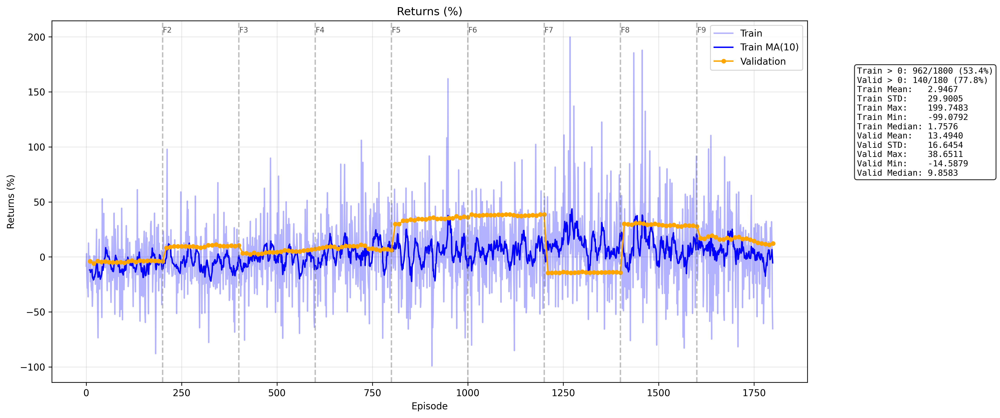
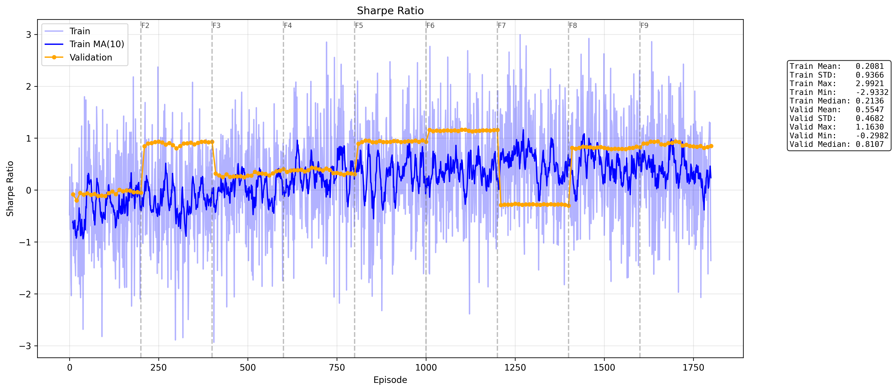
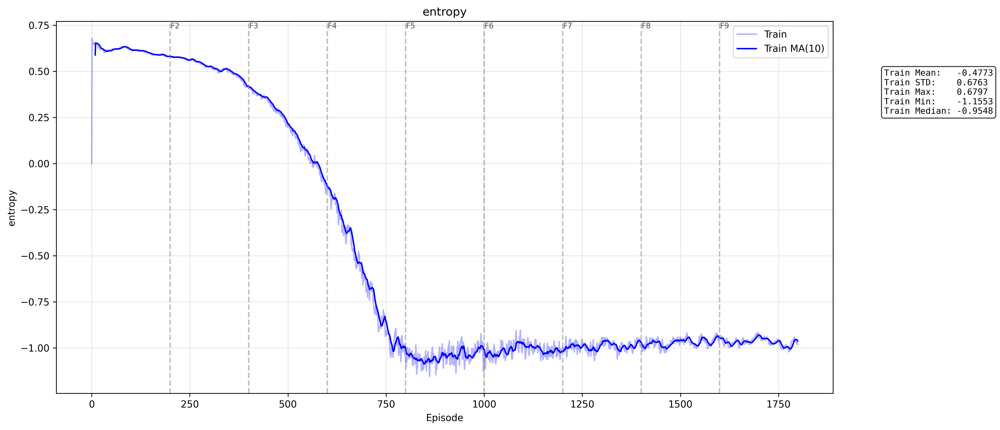
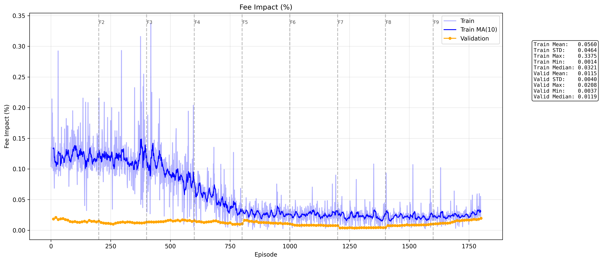

Charts show seed 42, the representative single seed; the headline figures above are the 3-seed MC mean ± std, which sit modestly below this particular seed's run.

<details>
<summary><b>Features & architecture — v6 (deltas + long-history; MLP encoder)</b></summary>

Delta from v5's feature set:

**Added — per-ticker deltas (4a):** 20-day deltas on medium-window level/ratio features (`ema_close_ratio_20`, `ema_20_60_ratio`, `adx_5_20_ratio`, `volatility_5_20_ratio`, `volume_5_20_ratio`), giving the last-bar snapshot its trajectory.

**Added — long-history per-ticker (4c):** 120/252-day base features (`log_return_120/252`, `ema_close_ratio_120/252`, `volatility_60_252_ratio`) with 60-day deltas.

**Rejected (kept in the tree, not in the capstone):** episode-Sharpe / `portfolio_state` subtractions (runs 1–2); macro regime features — yield curve, credit spread, size/growth factor, sector rotation (run 3a).

**Architecture:** the CNN-Transformer market encoder is replaced by an MLP on the most recent bar (`FeatureExtractor`, run 4b) — ~37% fewer params, ~33% faster, matched performance.

</details>

### v7 — the allocation pivot: 5-ticker basket (daily bars) · does not beat buy-and-hold out-of-sample

[PR #8](https://github.com/markk628/Project-Prometheus/pull/8)

The largest conceptual shift since the daily pivot, and the project's final chapter: from single-ticker *timing* to portfolio *allocation* across a fixed five-ticker asset-class basket — SPY (equities), TLT (treasuries), GLD (gold), USO (oil), UUP (dollar) — chosen for clean macro diversification. The action space becomes a 5-dimensional continuous target allocation (weights summing to ≤ 1, cash the implicit residual), the reward is joint portfolio return, and the state grows a 22-dimensional multi-asset portfolio vector (per-ticker positions, P&L, hold times, total exposure). The MLP-on-current-bar encoder from v6 carries over, now feeding a 5-output Actor and a shared encoder across the basket. The rationale is explicit: v6's ~0.48 Sharpe was roughly the ceiling for single-ticker timing at this data scale, and allocation — what most systematic equity strategies actually do — has structurally higher signal-to-noise.

On aggregate, the pivot looks like it worked. The mid-project baseline (target entropy = +3, a high target that forces sustained exploration — visible as entropy held near 3.0 rather than collapsing to the −1 of v5/v6) lands a 3-seed validation Sharpe of **0.674 ± 0.121** (median 0.618) at **+6.25% ± 1.68** return and **72.8% ± 3.4%** positive — nudging *above* v6 on a risk-adjusted basis, at lower absolute return, exactly as a diversified, lower-volatility basket should. Run 8 (seed 42, the charts here) is the strongest of the three seeds at Sharpe ~0.78. But that aggregate is a misleading summary, and the charts show why.

Validation climbs within each fold and then *craters* at every fold boundary — 40-to-100-point drops as the calendar year, and its regime, turns over. This is the **cross-fold cliff**: the policy memorizes its training regime and falls off a shelf when the next year's doesn't match. It was v7's dominant failure mode from run 1, and four separate interventions failed to move it — capacity and regularization (Run 2); a full four-point SAC entropy sweep (te = −5/+1/+2/+3, Run 3, which lifted within-fold levels and the positive rate but left the cliffs untouched, now a settled finding); the continuous macro-regime channel; and an appended discrete regime label (Run 4, washed out across seeds). Exploration tuning raised the ceiling but could not bridge regime boundaries, and more *signal* never moved them at all. v7 was **paused** on that diagnosis (June 2026).

The pause lasted a month. Resuming for the long-pending replay-buffer recency sweep produced the project's first structural win: **uniform replay** (buffer decay 3 → 0, Run 5) was the first lever in five swings to move the cliffs in a seed-consistent direction — the 2018→2019 drop shrank −26% and the 2020→2021 drop −29%, reduced on **3/3 seeds** (just short of the pre-registered 30% bar) — alongside a genuine robustness profile: validation std −28%, the worst single checkpoint lifted from −14.8% to −10.9%, skew halved, and the median checkpoint untouched (the −1.6pt mean cost is entirely trimmed 2020 high-tail). The mid-point MC (decay 1.5, Run 6) then showed **no knee — the robustness/mean tradeoff is linear in decay** — so uniform was locked as the final configuration (3-seed Sharpe 0.578 ± 0.095). The revised diagnosis: the cliffs are not an information problem — they respond to *coverage*, in proportion to how hard it is pushed. Smaller, not gone.

What remained was the question the project opened with: can it beat buy-and-hold? The endgame was pre-registered in the dev log's Backtest section — success criterion, protocol, and caveats all fixed before any final model was backtested — then executed as a one-shot test: a 3-seed retrain of the locked config with the 2023 validation year folded into training (a validation-less final segment whose episodes are containment-constrained, so training never touches a test-window bar), run on the held-out 2024–2025 window under two protocols (a headline **annual-reset** mirroring the training episode structure with boundary liquidation costs charged, and a continuous secondary whose gap to the headline measures episode-length drift). All three seeds reported, no selection. **The verdict: it does not beat a passive baseline** — 3-seed mean Sharpe 0.520 against buy-and-hold's 1.227, a profitable slice of beta with no risk-adjusted edge (full numbers in [Results](#results) below). The structural levers that were not reached — regime-balanced sampling, FiLM / mixture-of-experts conditioning — plus the Databento data migration and portfolio-state deltas are carried forward to Prometheus 2.0. Full run-by-run detail is in [`dev_log_v7.md`](https://github.com/markk628/Project-Prometheus/blob/main/src/v7/dev_log/dev_log_v7.md).

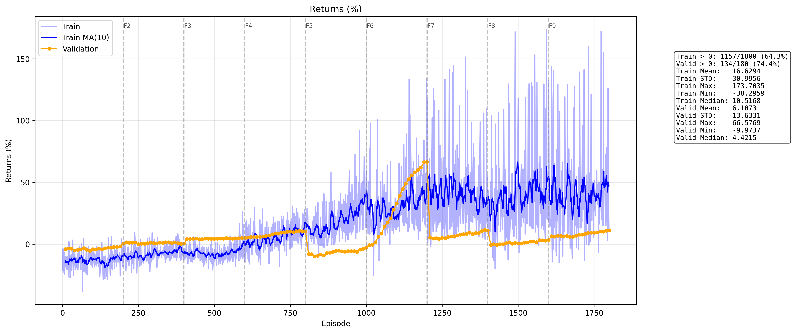
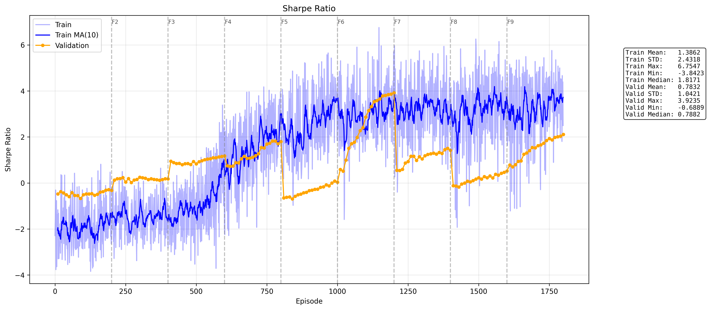
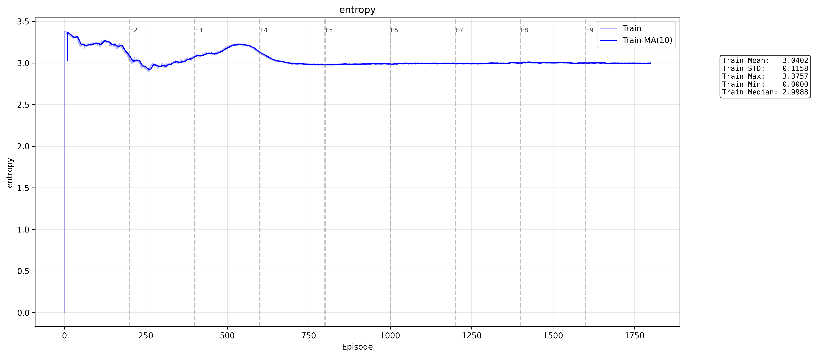
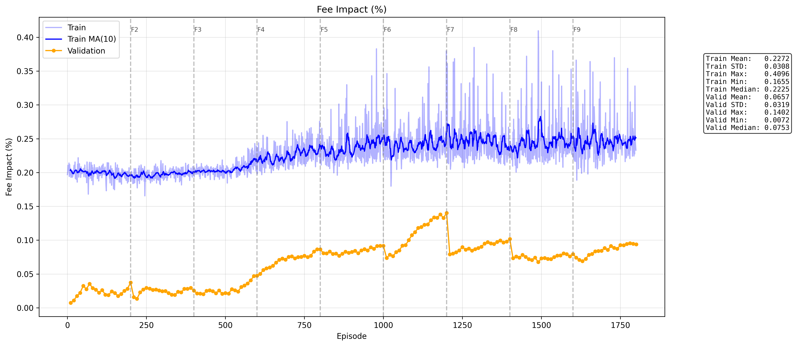

Charts show run 15 (uniform replay buffer, seed 42)

<details>
<summary><b>Features & architecture — v7 (5-ticker allocation)</b></summary>

**Basket (5):** SPY, TLT, GLD, USO, UUP — full-timeline asset-class ETFs, so no survivorship adjustment needed.

**Per-ticker market (43 each, 215 total):** the v6 daily feature set (returns, volatility, trend, volume, candlestick, long-history) per basket member. No cross-sectional z-scores or sector one-hots — basket members are excluded from the CS population and all map to one sector, so within-basket CS signal would be degenerate.

**Regime (45):** breadth, VIX term structure, RS-vs-SPY, and the macro families (yield curve, credit spread, size/growth factor, sector rotation) — the latter, rejected for single-ticker v6, kept here because allocation is the problem they fit.

**Temporal (6):** cyclical calendar encodings.

**Portfolio (22):** multi-asset — per-ticker positions, P&L, hold times, total exposure.

**Action (5):** continuous target allocation per ticker (cash implicit).

**Architecture:** MLP-on-current-bar encoder (from v6), shared across the basket; 5-output Actor, 5-input-action Critic.

</details>

## Results

Prometheus is a negative-leaning research result. Across seven versions it establishes a few things cleanly. Minute-level bars carry too little signal-to-noise for this class of model to trade, no matter how large the feature set (v1–v4). Daily bars with ticker-agnostic training *do* carry a real, if modest, edge — a walk-forward validation Sharpe around 0.47 on single-ticker timing (v5), holding at a simpler MLP architecture (v6). And the binding constraint on generalization is regime memorization — the replay buffer's recency emphasis and the resulting cross-fold cliffs — not features or capacity. Each of those conclusions was reached the same way: single-variable ablations, pre-registered decision rules, and multi-seed Monte Carlo sweeps to separate signal from seed noise.

What the project does *not* claim is a profitable, deployable strategy. The best validated configurations clear a positive risk-adjusted return within a fold but degrade sharply across regime boundaries, and the allocation pivot meant to sidestep single-ticker timing (v7) inherited the same wall. The value here is methodological: a reproducible pipeline with strictly causal normalization and no look-ahead, corporate-action and survivorship handling, transaction costs modeled rather than assumed away, and every result read straight.

**The out-of-sample test.** v7 is the only version taken to a true out-of-sample backtest, and it was run as a pre-registered, one-shot test: the success criterion (3-seed mean Sharpe on the headline protocol vs. the benchmark) and the full protocol were fixed in the dev log *before* any final model was backtested. Three independently seeded models — the locked configuration retrained with the 2023 validation year folded into training, so nothing in the final fit ever touched a test-window bar — were run on the held-out 2024–2025 window (unseen in both training and model selection) against an equal-weight hold of the same basket. All three seeds are reported; no seed was selected. The headline protocol mirrors training exactly (consecutive 252-day episodes, boundary liquidation costs charged):

| metric | seed 42 | seed 43 | seed 44 | **3-seed mean** | buy & hold (eq-wt) |
|---|---:|---:|---:|---:|---:|
| total return | +13.20% | +10.03% | +12.78% | **+12.00%** | +28.96% |
| annualized return | +6.43% | +4.93% | +6.24% | **+5.87%** | +13.65% |
| Sharpe | 0.599 | 0.411 | 0.550 | **0.520** | 1.227 |
| Sortino | 0.873 | 0.565 | 0.807 | **0.748** | 1.821 |
| Calmar | 0.929 | 0.561 | 0.716 | **0.735** | 1.696 |
| profit factor | 1.156 | 1.120 | 1.148 | **1.141** | 1.279 |
| max drawdown | 6.93% | 8.78% | 8.71% | **8.14%** | 8.05% |

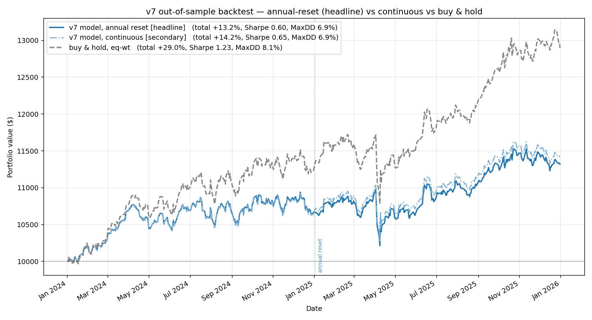
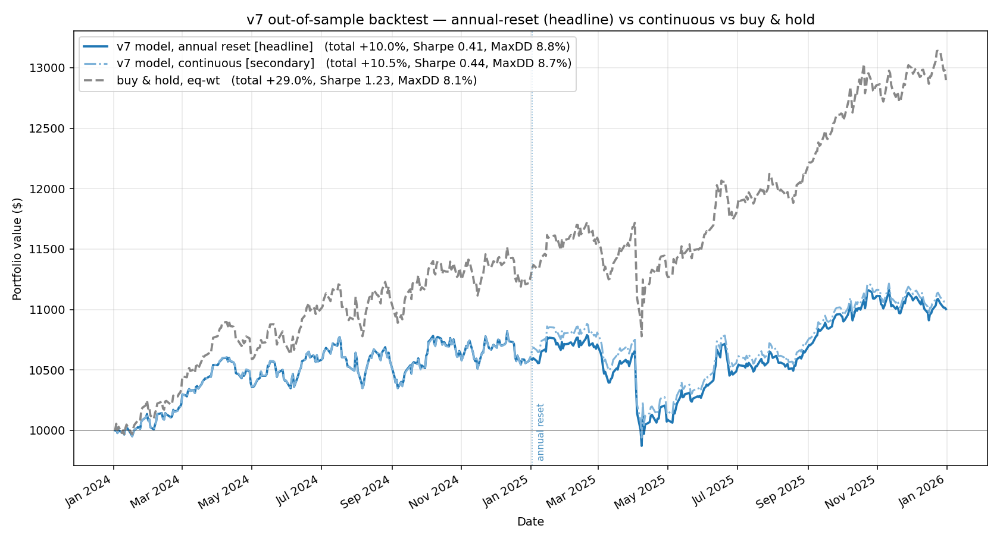
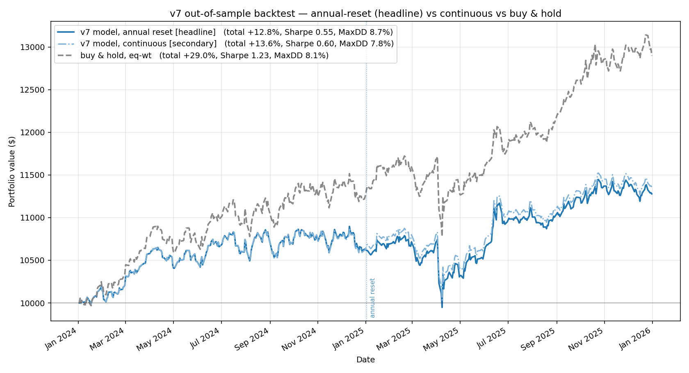

The result is unambiguous and stable across seeds: the model makes money — every seed positive, mean +12.0% — but captures under half of what simply holding the basket returned, at the same drawdown (8.1% vs. 8.0%). By the pre-registered criterion, 3-seed mean Sharpe 0.520 versus buy-and-hold's 1.227 is a clear miss — the gap is more than twice the ambiguity band that was defined in advance — and it lands in the criterion's pre-named *"profitable beta-slice, no edge over passive"* outcome. This is the regime-generalization wall the walk-forward cliffs diagnosed, now measured on genuinely unseen data under a criterion fixed beforehand: **v7 does not beat a passive baseline out-of-sample.** The tight cross-seed spread (Sharpe 0.41–0.60) is what makes that a finding rather than a fluke.

The open problem is well-posed and the next levers are identified — regime-conditioned architectures, regime-balanced sampling, and cleaner vendor data — which is where a future Prometheus 2.0 picks up.

## Lessons learned

The methodology was the point, and building it taught more than the trading results did. A few principles that this project drove home — most of them the hard way:

**Clean data is a fairytale.** Even data bought from a vendor has to be audited and cleaned before it is fit to train on. Gaps, splits and dividends, survivorship, bad prints, timestamp misalignment — none of it arrives handled, and every one of them will silently corrupt a model or, worse, leak the future into the past. "Sourced from a reputable provider" is the start of the data work, not the end of it.

**Documentation is not optional, and its absence compounds.** Writing this README meant going back to early versions that had little or no dev log — and having to reverse-engineer my own code to reconstruct what each run did and why. A result you can't explain later is a result you can't build on. The versions with disciplined dev logs (v4-7) were the ones that produced transferable findings; that is not a coincidence.

**Tuning against a backtest turns the backtest into a validation set.** This is the subtle one. The moment you look at an out-of-sample result and change the model in response, that data has been used for selection — it is no longer out-of-sample, and any number it produces afterward is optimistic. The only defense is procedural: pre-register the success criterion and the protocol *before* running the test, report every seed, and take exactly one shot. v7's endgame was built around this — the criterion was fixed in the dev log first, the final model was retrained with the last validation year folded in so nothing selectable remained, and the backtest was run once. The discipline is what makes the negative result trustworthy.

**Non-stationary time series need causal normalization.** Normalizing with statistics computed over the whole series (or any window that peeks forward) leaks future information into past observations — a subtle look-ahead that inflates validation and evaporates in live trading. Rolling, backward-looking normalization that only ever sees data up to the current bar is the honest choice for data whose distribution drifts over time.

**Non-stationary time series need walk-forward validation.** A traditional fixed percentage split only tells you how the model does on that one slice of history — which, for drifting data, is a single regime sample dressed up as a verdict. Expanding-window walk-forward tests the model across many successive regime transitions, which is exactly where these models fail. The fixed split hides the failure mode; walk-forward surfaces it. (It was walk-forward that exposed v7's cross-fold cliffs in the first place — a % split would have averaged them away.)

**Clever feature engineering unlocks data you already have.** This was the lesson I least expected. I started out thinking about features built from *one ticker's* data — its own price, its own volume — when the real gold mine was the rest of the raw data sitting unused. Two moves compounded here. First, training ticker-agnostically across many symbols rather than one at a time lets the agent learn from the whole cross-section of market behavior instead of a single instrument's idiosyncrasies — the difference between forecasting weather from a global view versus one backyard thermometer. Second, and the piece that makes the first one work: *cross-sectional normalization*. A raw value — a price, a dollar volume — only means something relative to the ticker it came from, so it can't teach a model anything general. Re-expressing each feature relative to the cross-section (as a percentile, rank, or z-score across all tickers at that timestamp) turns it into a scale-free, ticker-agnostic quantity that carries the same meaning everywhere — so a feature derived from almost any ticker becomes usable training signal for the whole basket. The daily, cross-sectional pivot (v5) is where the project first found real signal, and this engineering is a large part of why. The model architecture mattered far less than what I fed it.

**Less is more — put the intelligence in the inputs, not the architecture.** I went in certain a CNN-Transformer could not possibly lose to a plain MLP. It did. Once the MLP was given delta features — precomputed changes between bars — it matched the heavier CNN-Transformer and then beat it, at a fraction of the parameters and compute. The reason is the same insight as the feature-engineering lesson from the other side: the sequence model was spending most of its capacity *learning to extract* temporal patterns from a raw window — patterns I could simply compute and hand it directly. Once the inputs carry that information, the expensive machinery has nothing left to earn. And the engineered version is strictly better in two ways: (A) it isn't bound to a fixed window — a delta can be taken between samples arbitrarily far apart, where the convolution only sees its receptive field; and (B) with far fewer parameters it overfits far less, which matters enormously on noisy, non-stationary financial data where overfitting is the default failure mode. The v6→v7 encoder is a plain last-bar MLP for exactly this reason. Reach for architectural complexity only after simpler models with better features have been ruled out — not before.

## Setup & usage

Full reproduction is not turnkey: the pipeline runs on Massive's proprietary flat-file data — tens of thousands of tickers over ~22 years — so there is no clone-and-run path without a paid data account. The steps below stand the project up if you have that access; the methodology and results above stand on their own without it.

### Prerequisites

**Data — Massive (formerly Polygon.io).** The pipeline is built on Massive's flat files and REST API. Reproducing it requires the [Individual Stocks Advanced plan](https://massive.com/pricing), which grants both the S3 flat-file access and the API used for splits and ticker metadata.

**Database — optional.** The pipeline reads columnar Parquet by default; the database ingestion path (shelved for the project — see [Design decisions](#design-decisions)) is only needed if you use it, and requires a local PostgreSQL instance with the TimescaleDB extension.

**Secrets.** Create a `.env` file inside the config directory (`src/config/`) with:

```dotenv
MASSIVE_AWSKEY = ''
MASSIVE_APIKEY = ''

DATABASE_HOST = ''
DATABASE_PORT = 
DATABASE_NAME = ''
DATABASE_USER = ''
DATABASE_PASSWORD = ''
```

Replace the blanks with the appropriate values.

Both Massive keys come from the [dashboard](https://massive.com/dashboard): the API key under **Keys → Key**, and the flat-file S3 access key under **Keys → Flat Files (S3) Access → View details → Access Key ID**. The `DATABASE_*` variables are only required for the optional database path — leave them blank otherwise.

**Flat files.** Massive's [flat-files quickstart](https://massive.com/docs/flat-files/quickstart) is the authoritative guide; the commands below are a convenience snapshot and may drift as the vendor changes. Configure the AWS CLI with your Massive S3 credentials (**Keys → Flat Files (S3) Access** in the dashboard), then sync the aggregates:

```bash
pip install awscli
aws configure   # Access Key ID + Secret Access Key from the dashboard; region us-east-1; output json

aws s3 sync s3://flatfiles/us_stocks_sip/day_aggs_v1/    ./day_data    --endpoint-url https://files.massive.com
aws s3 sync s3://flatfiles/us_stocks_sip/minute_aggs_v1/ ./minute_data --endpoint-url https://files.massive.com
```

Then move the downloaded year directories under `data/raw/`, so the layout is `data/raw/day_data/2003/`, `data/raw/day_data/2004/`, … (use `data/raw/minute_data/` for minute bars). The raw downloads are sizable — the minute aggregates run over 77 GB and the daily aggregates about 870 MB — so budget disk space accordingly.

### Environment

Install Anaconda or Miniconda, then recreate the environment from `environment.yml` and activate it:

```bash
conda env create -f environment.yml
conda activate prometheus
```

The environment is conda-managed for Python 3.10, but its dependencies are pip-installed (pinned to a working set after conda/pip version conflicts). PyTorch is pinned to the CUDA 12.1 build (`torch==2.5.1+cu121`), so a CUDA 12.1-capable GPU is assumed; on a CPU-only machine, drop the `--extra-index-url` line and the `+cu121` suffixes in `environment.yml`. One dependency can need extra setup: TA-Lib (`ta-lib==0.6.8`) wraps a native C library — the PyPI wheels bundle it on common platforms, but on others you may need the C library installed first (see [ta-lib-python](https://github.com/ta-lib/ta-lib-python)).

The project was developed on Windows 11 with a 13th-gen Intel i9-13900HX, an RTX 4080 laptop GPU (12 GB VRAM), and 32 GB of RAM — enough to run every version end to end. 32 GB is roughly the practical floor: the memory-efficient replay buffer and streaming normalization exist in part to keep training within that budget.

### Run flow

Each version lives on its own branch (`v1`–`v7`), and because the config evolved alongside the code, you run a given version by checking out its branch and invoking its `src/v<N>` package. Substitute the version number for `<N>`:

```bash
python -m src.v<N>.preprocessing.preprocessor   # preprocess raw flat files → unified feature set
python -m src.v<N>.training.trainer             # train (walk-forward across folds)
python -m src.v<N>.backtesting.backtester       # out-of-sample backtest — v4 and v7 only
```

Only **v4 and v7** ship a backtesting module. v4's backtester needs the `model_path` variable set manually to the checkpoint you want to evaluate; v7's picks up the latest saved model automatically unless one is specified. (The project holds every version's code within their directory, but the config only runs v7 — so check out a version's own branch to run anything earlier.)