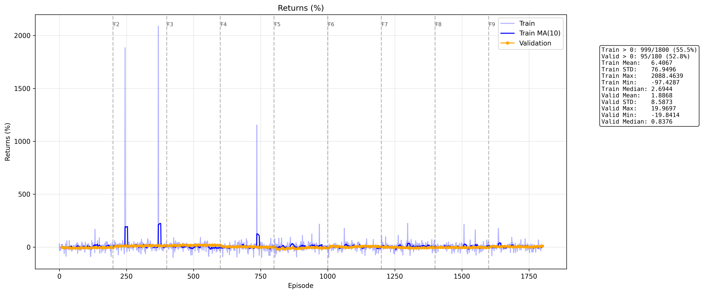
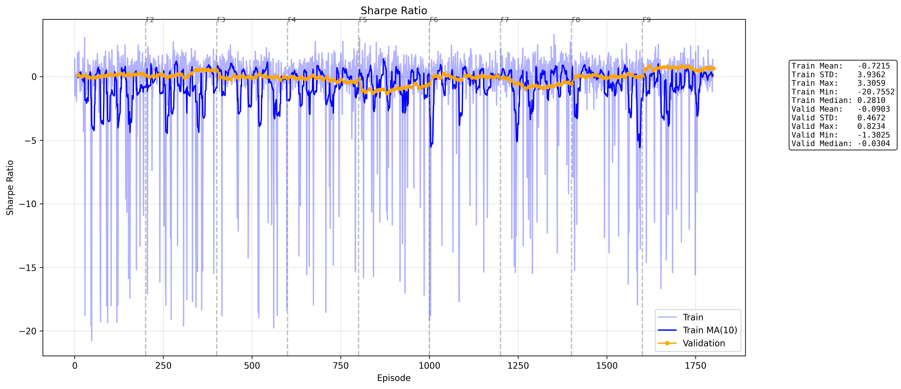
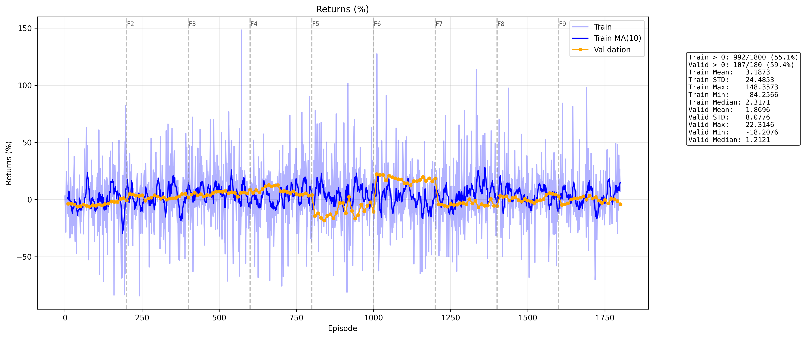
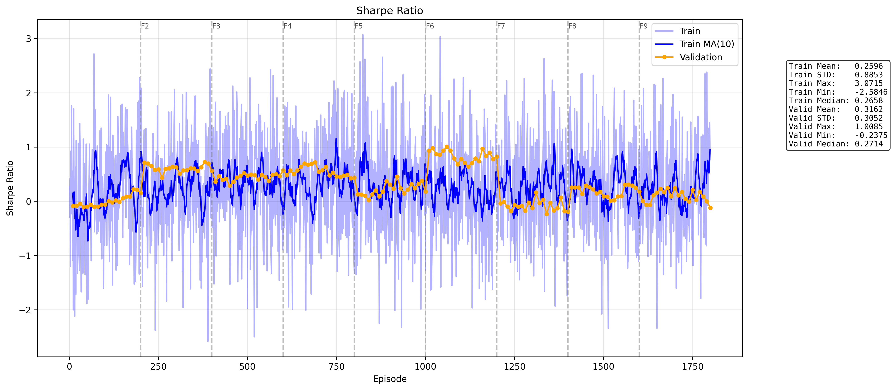
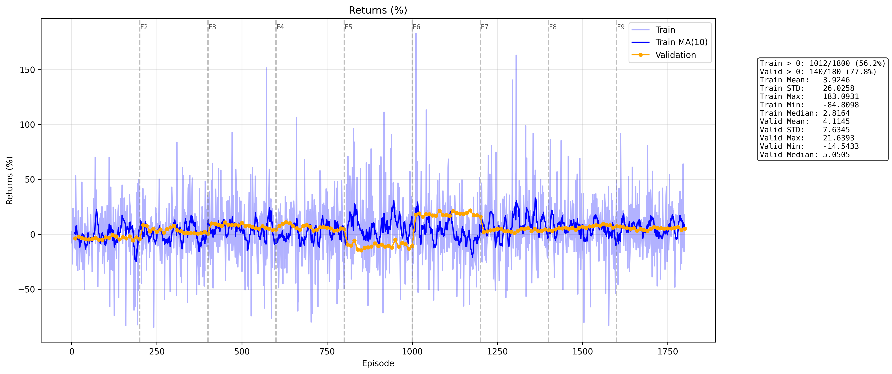
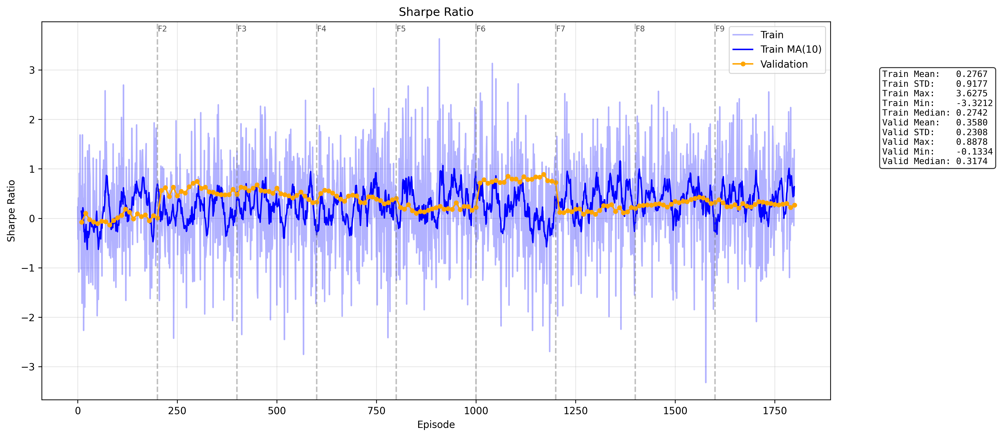
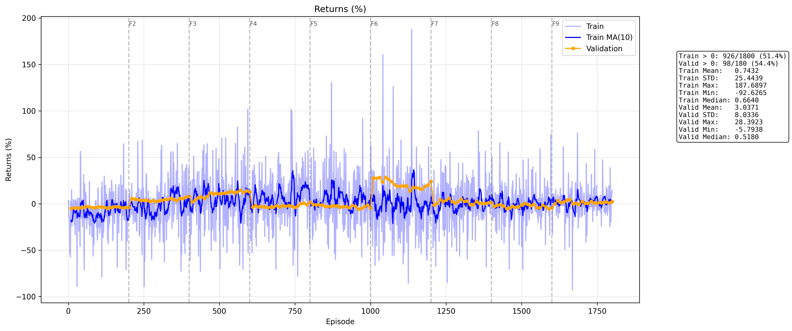
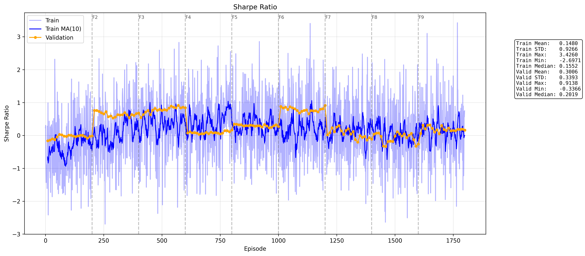
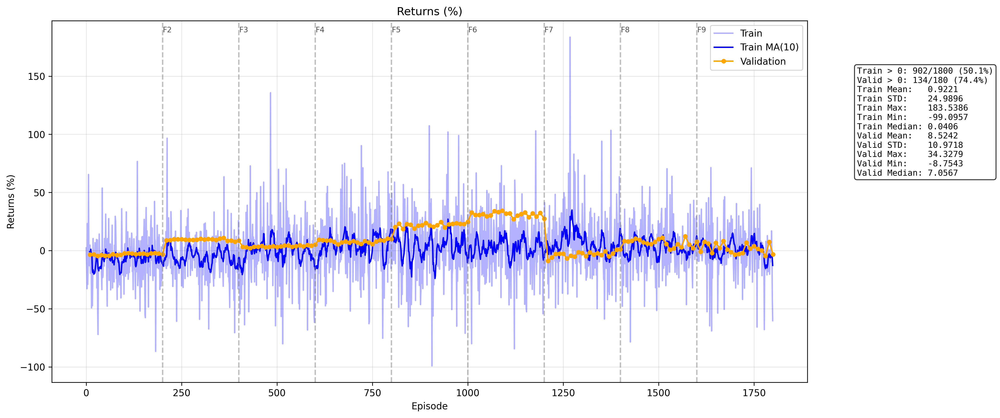

# v5 Dev Log

Working notes from the v5 daily-bar SAC trading project. Captures what was tried, what happened, what we learned, in roughly chronological order.

For pipeline-specific documentation see `preprocessing.md` (in preprocessing directory). 

This file focuses on training runs, debugging arcs, and the lessons that came out of them.

Refer to the run_N_description directories for graphs and fold validation results of each run.

---

## Run 1 — Catastrophic Outliers, Hidden Data Bugs

**Setup:** First training run of v5 architecture. Hybrid CNN+Transformer encoder, daily bars, 60-day window, 252-day episodes, walk-forward validation across 9 folds.

**What happened:** Training "worked" but returns plot showed pathological outliers — episodes with +2088% (CIT), +1883% (TRU), +1153% (CC) returns. Validation metrics like Sortino 47.62 and Calmar 10.00 were saturating against env-imposed caps but the raw return number was uncapped.

**Investigation traced two underlying bugs:**

1. **`_handle_gaps` forward-filling across long bankruptcy gaps.** CIT filed Chapter 11 on 2009-11-01 at ~$45, emerged 2009-12-10 at ~$26. Raw data had ~28 trading days of nulls. The function forward-filled $45 through all of them, then the relist day looked like a fake -42% one-day "drop" the agent could exploit.

2. **`_build_unified` 0-filling `_close` columns.** Post-delisting nulls became "tradable at $0" — masked at runtime by the trainer's `prices > 0` check, but semantically wrong and a latent footgun.

**Fixes shipped:**

- **Lifecycle segmentation** (`_split_lifecycle_segments`): tickers with gaps ≥10 trading days split into independent segments named `{TICKER}.{N}` (e.g. `CIT.1`, `CIT.2`). Each segment processed independently — no fake jumps, no bleed across lifetimes.
- **Per-segment split filtering**: `_apply_split_adjustments` now takes `segment_end_date` and filters splits via `execution_date <= segment_end_date`. Prevents post-BK splits from leaking into pre-BK segment adjustment factors.
- **Close-null preservation**: `_build_unified` no longer 0-fills `_close` columns. Honest encoding of "ticker doesn't exist here."

**Auditor additions:**

- `_check_price_discontinuities` — flags single-day log-return breaches (suspicious ≥ 50%, critical ≥ 100%).
- `_classify_close_nulls` — suppresses benign delisting/pre-IPO null warnings from the report (covered by survivorship check).

---

## Run 2 — Clean Baseline

**Setup:** Same architecture and hyperparameters as run 1. All data fixes applied. Discontinuity gate moved upstream into `_process_ticker` (filters tickers with critical breaches before they reach training). Penny-stock floor added in `_filter_tickers_by_liquidity` (median close ≥ $5).

**Architectural cleanup along the way:** Trainer became a pure consumer of `unified.parquet`. All filtering decisions live in feature_engineer. Auditor verifies, doesn't filter.

**Results:**

- Validation mean return: +1.87%
- Validation Sharpe: 0.32
- Validation positive rate: 59.4%
- Q-value monotonically declining through training, alpha collapsed to ~0.013 by fold 9
- Pattern: convergence-before-data, model stops learning ~fold 6

**Diagnosis:** Pathological data bugs gone; model learning a real but mediocre signal. Validation returns barely positive after fees. Honest baseline.

**Polygon data-quality discoveries during this period:**

- ~1,108 "suspicious" 50–100% one-day moves, disproportionately clustered at exact 50%/100% boundaries — clear signature of unapplied splits Polygon doesn't have records for.
- Verified via direct API call that GOOG's 2014-04-03 Class C split is missing from Polygon's splits endpoint. Their database only has the 2022 stock dividend.
- Decision: live with it for v5, document in `preprocessing.md`. Vendor migration to Databento pushed to v7.

---

## Run 3 — Long-Horizon Regime Features

**Hypothesis:** Run 2's plateau at +1.87% suggested the model had fitted what it could from short-horizon features (5/20/60d windows). Adding long-horizon regime context might let it distinguish "this pattern in regime X" from "this pattern in regime Y."

**Changes:**

- Added `breadth_200d` (% of stocks above 200d MA) to shared regime features
- Added `rs_spy_252d` (per-ticker relative-strength vs SPY over 252d) to per-ticker regime
- Scale-matched delta windows: long-horizon levels get medium deltas `[20, 60]`, short-horizon levels keep their existing short deltas `[1, 5, 20]`. Avoided the noisy cross-scale combinations (1d delta on 200d series adds nothing; 60d delta on 5d series is a 2-point estimate).
- Trainer's `per_ticker_regime_suffixes` extended for new RS columns.
- Required preprocessing rerun (~+9k columns added to unified parquet).

**Results:**

- Validation mean return: **+4.11%** (+120% vs run 2)
- Validation median return: **+5.05%** (+317% vs run 2)
- Validation Sharpe: 0.36 (slight improvement)
- Validation positive rate: **77.8%** (+18.4 pts vs run 2)
- Validation STD dropped 8.08 → 7.63 (more consistent)
- Train STD slightly up (24.5 → 26.0); validation dramatically tighter — features acted as regularizer

**Per-fold trajectory:** Validation curve much smoother than run 2. Fold 5 (2019, post-2018-Q4-selloff regime) still dipped to -10.54% but the pattern across folds was qualitatively different from run 2's collapse-at-fold-7 behavior.

**Diagnosis:** Long-horizon regime features are doing real work as a regularizer. Model generalizes meaningfully better across regime transitions. Loss curves showed continued learning through fold 9 (Q-value still rising, critic loss still falling) — model hadn't fully converged when training ended.

**Open question after run 3:** Alpha collapse pattern unchanged from run 2 (~0.025 by fold 9 in both). Better features made the actor confident faster, accelerating entropy collapse. Suggested run 4 needed to address the convergence-before-data issue rather than add more features.

---

## Run 4 — UTD=4 + Slow Alpha LR (Overfitting)

**Hypothesis:** Run 3's loss curves showed continued learning at fold 9 — model hadn't converged. More gradient updates per env step (UTD=4) should let the agent extract more signal from existing data. Slower alpha LR (1e-5) was a compensating change to prevent the 4× more updates from accelerating alpha collapse.

**Changes:**

- `UPDATE_RATIO: 1 → 4`. Each `update_parameters` call now does 4 gradient passes on different replay batches. Refactored into a `_gradient_step` helper for the inner loop.
- `LEARNING_RATE_ALPHA: 1e-4 → 1e-5`. 10× slowdown.
- Soft target update kept at once-per-env-step (not per gradient step) — TAU calibrated for lower frequency.
- Returned metrics averaged across the N gradient passes per call.

**Results:**

- Validation mean return: **+3.04%** (worse than run 3's +4.11%)
- Validation Sharpe (mean): 0.30
- Validation positive rate: 54.4% (down 23 pts from run 3)
- Validation max: +28.4%
- Wall clock: ~16 hours (vs run 3's ~5)

**The interesting story is the trajectory, not the aggregate:**

| Fold | Run 3 Sharpe | Run 4 Sharpe |
|---|---|---|
| 2 | 0.48 | 0.68 |
| 3 | 0.33 | **0.77** |
| 4 | 0.40 | 0.17 |
| 5 | 0.22 | 0.27 |
| 6 | 0.72 | **0.91** |
| 7 | 0.20 | -0.11 |
| 8 | 0.32 | -0.26 |
| 9 | 0.27 | 0.16 |

Run 4 had a higher peak (Sharpe 0.91 in fold 6) and a worse landing (Sharpe negative in folds 7-8). Net: better in early folds, dramatically worse in late folds.

**Diagnosis: overfitting.** Two pieces of evidence converged:

1. **Actor loss dipped down in late folds** while validation got worse. Training objective improving + validation degrading = model fitting noise.
2. **Q-value rose in late folds** (from -25 to -17) just as validation showed those returns weren't realizing. Critic and actor agreeing on a wrong policy.

Run 4 trained the network "harder" on the same data and the network learned training-distribution noise. UTD=4 removed the implicit regularization that 1 update per env step provided.

**Slow alpha LR was effectively neutralized.** The 10× LR slowdown was cancelled by the 4× more updates per env step. Final alpha trajectory was indistinguishable from run 3's. The intended "preserve exploration through later folds" effect didn't happen — alpha still collapsed to ~0.025 by fold 5. So run 4 was effectively pure UTD=4 with run-3-equivalent alpha.

**Decision:** UTD=4 rejected as a single-variable change. Useful negative result — it proved gradient-update density past a certain point hurts generalization for this setup.

---

## Run 5 — UTD=2 (The Sweet Spot)

**Hypothesis:** UTD=1 (run 3) and UTD=4 (run 4) bracket the answer. UTD=2 should land between them. Either confirms gradient-update density doesn't matter much (run 3 wins), or finds a sweet spot.

**Changes:**

- `UPDATE_RATIO: 4 → 2`. Halved gradient passes per env step relative to run 4.
- All other config from run 4 unchanged (LEARNING_RATE_ALPHA stayed at 1e-5).
- Wall clock: ~9 hours.

**Results — best run of v5 by every meaningful metric:**

- Validation mean return: **+8.52%** (more than 2× run 3's +4.11%)
- Validation Sharpe (mean): **0.47** (vs run 3's 0.36)
- Validation positive rate: 74.4%
- Validation max: **+34.3%**
- Validation median: +7.06%

**Per-fold trajectory comparison:**

| Fold | Run 3 Sharpe | Run 4 Sharpe | Run 5 Sharpe |
|---|---|---|---|
| 2 | 0.48 | 0.68 | **0.86** |
| 3 | 0.33 | 0.77 | 0.37 |
| 4 | 0.40 | 0.17 | 0.43 |
| 5 | 0.22 | 0.27 | **0.86** |
| 6 | 0.72 | 0.91 | **1.03** |
| 7 | 0.20 | -0.11 | 0.05 |
| 8 | 0.32 | -0.26 | 0.42 |
| 9 | 0.27 | 0.16 | 0.28 |

**Two specific results worth flagging:**

- **Fold 6 sustained Sharpe above 1.0** across 18 of 20 validation calls. Validation returns +27% to +34% with 9-10 of 10 episodes positive. First time any run cleared Sharpe 1.0 in any fold.
- **Fold 5 went from disaster to triumph.** Run 3 fold 5 ended at -10.54% / Sharpe 0.22 / 40% positive. Run 5 fold 5 ended at +24.73% / Sharpe 0.86 / 80% positive — same fold, same general validation period, dramatically different outcome.

**Diagnosis: UTD=2 is the regularization sweet spot.** Three-point dose-response curve across the UTD ablation:

- UTD=1: underfit (run 3 — Q-value still rising at end of training)
- UTD=2: well-fit (run 5 — clean validation gains, no overfitting signature)
- UTD=4: overfit (run 4 — actor loss dropping while validation degrades)

The training loss curves in run 5 are similar to run 4's (critic loss rising then falling, Q-value bottoming late then recovering) but the validation goes the right direction. Same training shape, opposite validation shape. The difference is gradient-update density crossing some implicit-regularization threshold.

**This is the v5 capstone result.**

---

## Cross-Cutting Lessons Internalized

**Single-variable changes per run.** Every run after run 1 isolated exactly one variable (run 2 = data fixes, run 3 = long-horizon features). Made attribution clean: when run 3 jumped from 1.87% → 4.11%, we knew exactly what caused it. Bundling would have lost that.

**Trainer is a pure consumer of clean data.** All filtering decisions are upstream in `feature_engineer.py`. The discontinuity gate started in trainer (where we noticed the bug), moved through `_filter_tickers_by_liquidity` (wrong, operates on raw prices), settled in `_process_ticker` after split adjustment (right). End state: trainer has zero data-quality logic.

**Auditor verifies, doesn't filter.** After lifecycle splitting + discontinuity gate, the auditor's critical-breach count should be ~0. If it's not, the filter chain has a hole. It's a regression test, not a data preparation step.

**Polygon caveats are mostly vendor-specific compensation.** Lifecycle segmentation, penny-stock floor, liquidity filters — all universal. Discontinuity gate and manual ticker-event handling are Polygon-specific. Captured in `preprocessing.md`'s "Vendor caveats" section so future-me knows what's compensating for what.

**Read fold 1 as fold 1, not as a verdict on the run.** Fold 1's validation period happens to be a hard year that no run handles well — both run 2 and run 3 had flat-negative fold 1 readings while doing fine across folds 2-9. Don't kill a run based on fold 1 alone.

**Look at within-fold trajectory, not just snapshot.** A fold ending at +5% mean tells you where the model landed. The trajectory across the 20 validation calls inside the fold tells you whether it's still improving or has plateaued. Both numbers matter for "is this run worth continuing."

**Negative results are useful.** Run 4 looked bad in headline numbers but produced a clean diagnosis (UTD=4 overfits) that constrained the search. Without run 4, the UTD=2 sweet spot wouldn't have made sense to test. Negative results that point at specific causes are worth their wall-clock.

**Don't skip ablation runs because the result feels predictable.** Run 5 (UTD=2) was almost skipped as "incremental refinement." It turned out to be the v5 capstone. The intuition that bracketing tests have low informational value was wrong here — UTD=2 didn't land between UTD=1 and UTD=4, it beat both. Three-point dose-response curves can have non-monotonic shapes.

**Loss-curve overfitting signatures matter.** Actor loss dropping in late folds while validation degrades is a clear "model fitting training-distribution noise" signal. Worth scanning for in every run.

---

## Where v5 Ended

- Data is clean. Critical discontinuities = 0 in audit. Penny stocks excluded.
- ~3,000 tradable tickers + 25 regime tickers, 22 years of training data, 9 walk-forward folds.
- Best configuration: run 3 features + run 4's slow alpha LR + UTD=2.
- Validation Sharpe 0.47 mean, 74.4% positive rate, peak Sharpe 1.07 in fold 6.
- v5 closes with a clean UTD ablation across {1, 2, 4} and a clear winner.

---

## Pending / Future Work

Captured here so the threads don't get lost:

- **v6**: small wins first (Sharpe-from-portfolio_state removal, more regime features), then bigger architecture experiments (encoder vs MLP+deltas, replay warmup, blowup early-termination). Builds on UTD=2 baseline. See `v6_handoff.md` for full plan.
- **v7**: 5-ticker portfolio. Conceptual shift from single-ticker timing to allocation. See `v6_handoff.md`.
- **Vendor migration to Databento** (v7 prerequisite): Polygon's missing splits cost us ~14% of the universe via the discontinuity filter. Cleaner data would recover those.
- **Determinism hardening** for v6 architecture ablations: cudnn deterministic mode, full seed coverage, locked column order in unified parquet. Worth the cost for proper A/B testing.
- **File-splitting refactor** of `feature_engineer.py` (~3000 lines). Pure housekeeping, no logic changes.